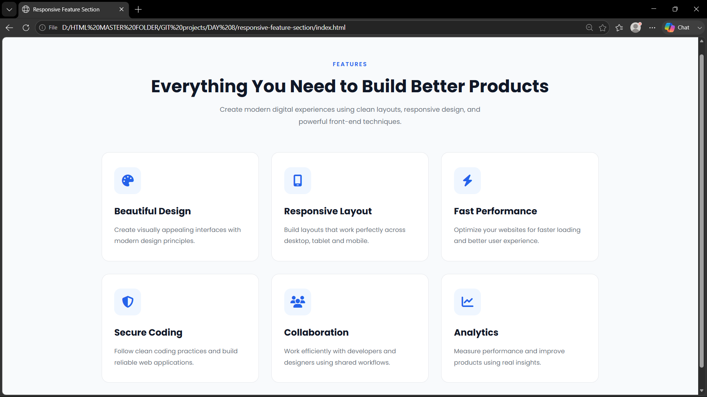

# Responsive Feature Section

A modern and responsive feature section built using **HTML5** and **CSS3**. This project showcases feature cards with icons, clean typography, responsive layouts, hover effects, and reusable card components.

---

## 🚀 Features

- Responsive Feature Section
- Modern Card Design
- Font Awesome Icons
- CSS Grid Layout
- Responsive Design
- Hover Effects
- Clean Typography
- Mobile Friendly
- Reusable Card Components

---

## 🛠 Technologies Used

- HTML5
- CSS3
- CSS Variables
- CSS Grid
- Flexbox
- Google Fonts
- Font Awesome

---

## 📸 Preview

Save your project screenshot as **`screenshot_design.png`** in the root folder.

```text
responsive-feature-section/
│── screenshot.png
```

Then add this to your README:

```markdown

```

---

## 📂 Project Structure

```text
responsive-feature-section/
│── index.html
│── style.css
│── README.md
│── screenshot.png
```

---

## 📌 Day 8 Skills Practiced

- Semantic HTML5
- CSS Variables
- CSS Grid
- Flexbox
- Responsive Design
- Hover Effects
- Card Components
- Font Awesome Icons
- Google Fonts
- Mobile-First Responsive Layout

---

## 📚 What I Learned

- Building reusable feature cards
- Creating responsive layouts using CSS Grid
- Using Flexbox for alignment
- Organizing scalable HTML structure
- Applying CSS Variables for maintainability
- Designing modern hover interactions
- Improving responsive typography
- Writing clean and readable CSS

---

## 📱 Responsive Support

- Desktop
- Laptop
- Tablet
- Mobile

---

## 👨‍💻 Author

**Vignesh**

UI/UX Designer • Front-End Developer

**GitHub**  
https://github.com/codingwithvignesh

**Portfolio**  
https://vigneshux.netlify.app
